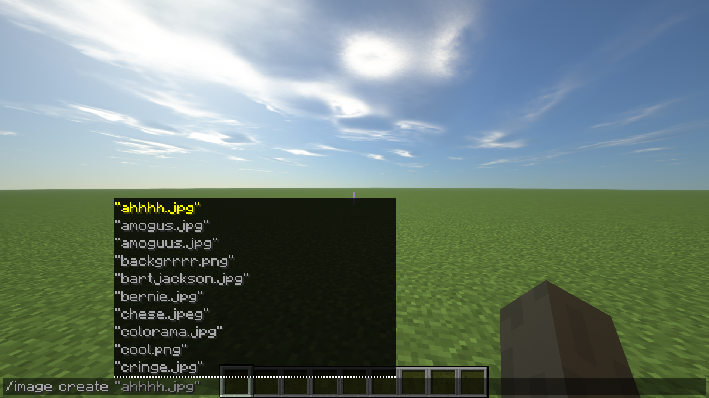
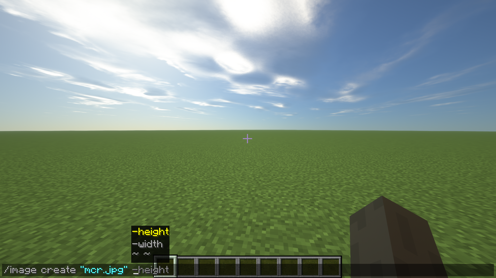
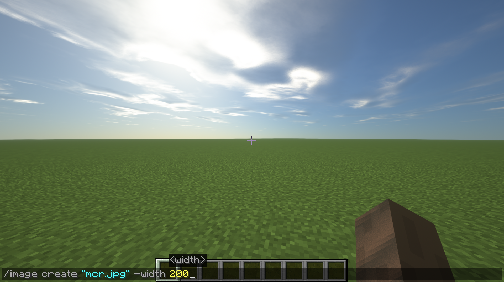
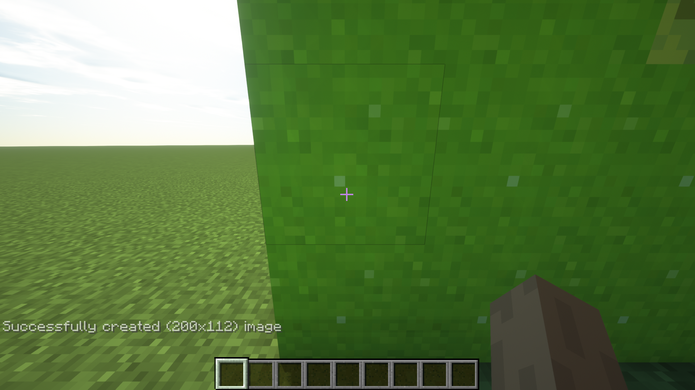
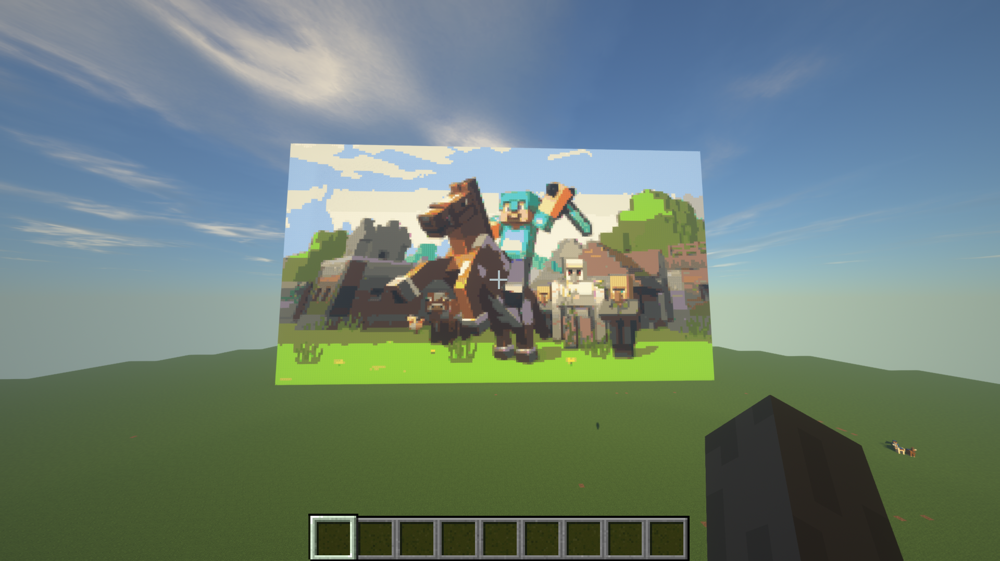

## How to use
This mod has one main feature - **/image** command that lets you create images in your Minecraft world as a surface of blocks from files on your computer.

### Setup
/image setDirectory <*DirectoryPath*> - Set a directory for your images to avoid copying & pasting full paths all the time! (*Suggestion is to use your downloads folder*)

### Usage
/image create <*ImagePath*> -width <*width*> - create image with a defined block width (height to scale)

/image create <*ImagePath*> -height <*height*> - create image with a defined block height (width to scale)

/image create <*ImagePath*> <*width*> <*height*> - create image with a defined block width & height

